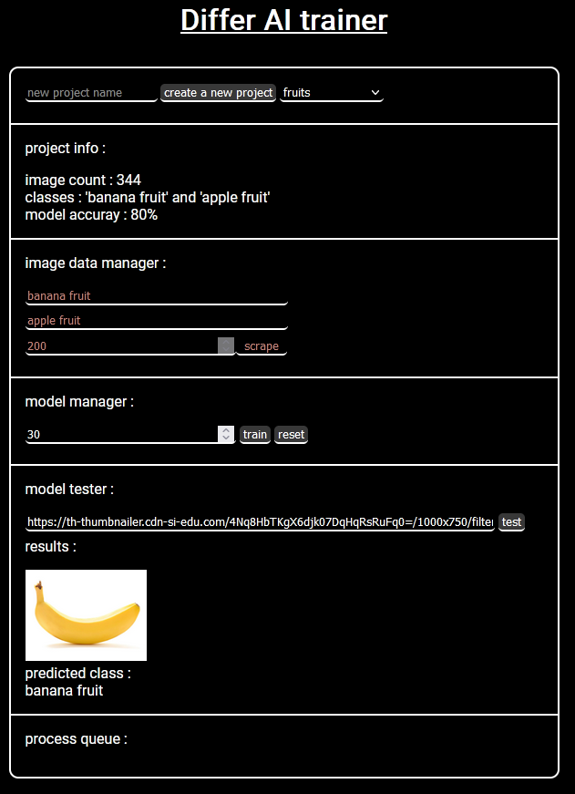

# Differ AI trainer

## setup

### 1. Clone git repo

`git clone https://github.com/Corentin-Rougeon/Differ-AI-trainer.git`

### 2. install dependencies

`pip install -r requirements.txt`

### 3. install cuda (for tensorflow)

see
https://www.tensorflow.org/install/source#gpu

### 4. run app

`run main.py`

### 5. go to website

`localhost:5000` or
`127.0.0.1:5000`

## objectives :

main objectives :
- [X] project management
- [X] image scraper
- [X] model trainer
- [X] model tester

features to do :
- [ ] download model
- [ ] resume image scraping
- [ ] reset model